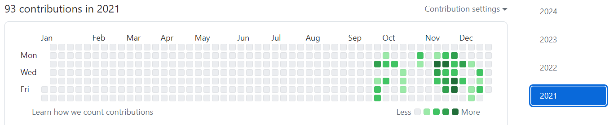
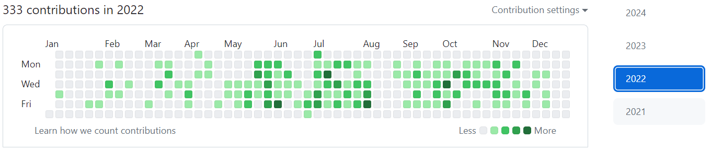
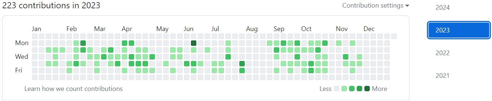

<h1> Hey! NICE to see you.</h1>

Welcome to my page!   I'm Liza, Frontend developer from  <b>Kyiv, Ukraine</b>, currently living here. 

<h3>I code with</h3>

  
  
  
  
  
  
  
  
   
  
  
  
  
  
  
  
  
  
  
  
  
  
  
  
  
  
  
  

Here are some screenshots of my previous commercial contribution activity:

- repository is private and owned by organization, the link to my commercial gitHub account: 
<a href="https://github.com/ElizabethKudelia">https://github.com/ElizabethKudelia</a>

<!---
ElizabethKudelia/ElizabethKudelia is a ✨ special ✨ repository because its `README.md` (this file) appears on your GitHub profile.
You can click the Preview link to take a look at your changes.
--->
